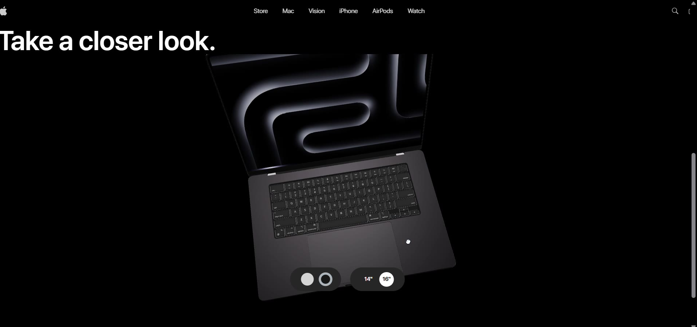
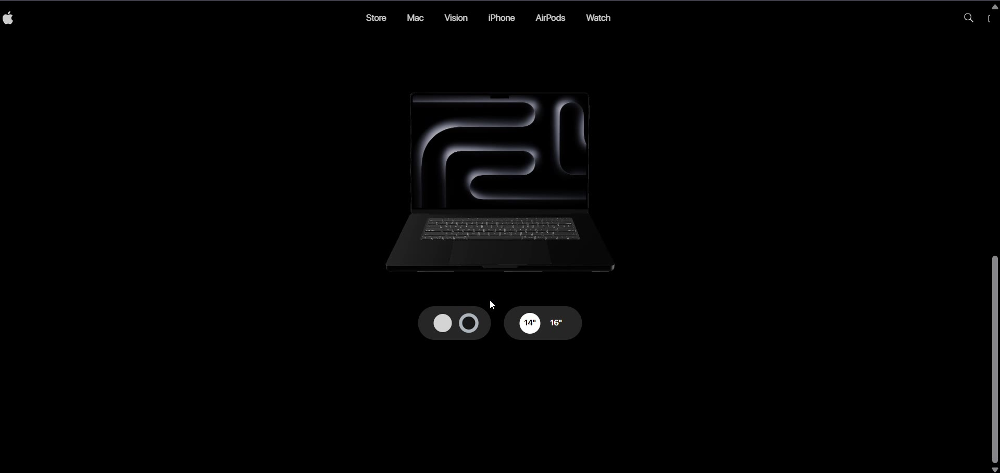
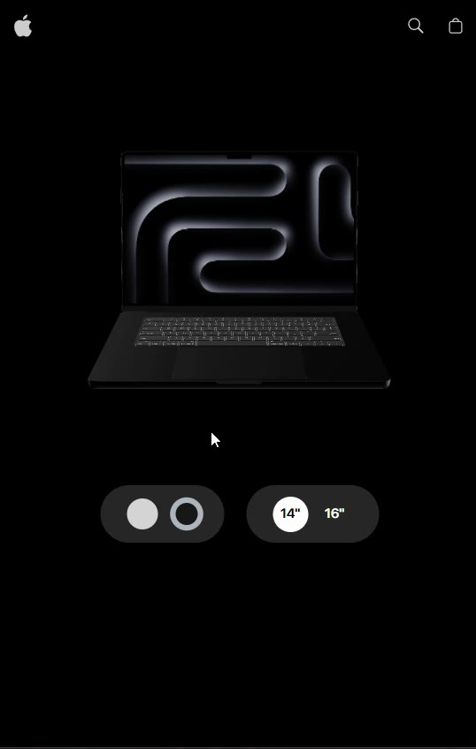
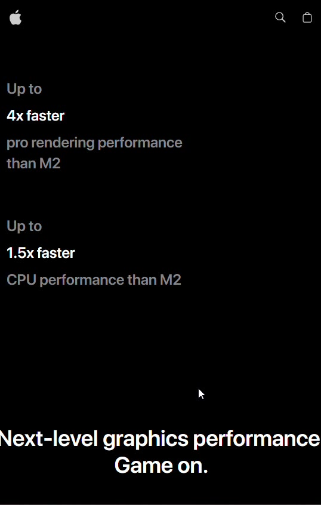

# MacBook Pro — 3D Interactive Landing Page

A responsive MacBook Pro product landing page built with React, Three.js and GSAP.

This project focuses on creating a smooth, interactive product-showcase experience with a 3D MacBook model, scroll-based animations, video sections, and responsive layouts for desktop and mobile.

> **Note:** This is an independent learning/portfolio project inspired by Apple's product presentation style. It is not an official Apple website and is not affiliated with Apple.

## Preview

### Desktop

<p align="center">
  
</p>

<p align="center">
  
</p>

### Mobile

<p align="center">
  
  &nbsp;&nbsp;
  
</p>

The screenshots above were captured from the project's desktop and mobile screen recordings.

## About the Project

I built this project to practice creating a modern product landing page with a strong focus on animation, 3D interaction, and responsive design.

The main idea was to recreate the type of visual experience used in high-end product websites rather than making a simple static landing page.

The page combines:

- Interactive 3D MacBook models
- GSAP scroll animations
- Three.js / React Three Fiber scenes
- Video-based product sections
- Responsive desktop and mobile layouts
- Product color and size controls
- Animated performance and feature sections

## Features

### 1. Interactive 3D MacBook Viewer

The product viewer uses a 3D MacBook model rendered with React Three Fiber.

Users can:

- Switch between different MacBook sizes
- Switch between product colors
- View the model inside an interactive 3D scene
- Interact with the model using the 3D viewer controls

### 2. GSAP Scroll Animations

GSAP is used throughout the page to create scroll-driven interactions.

The animations include:

- Pinned sections
- Product model rotation
- Text reveal animations
- Image positioning
- Feature transitions
- Scroll-synchronized content
- Smooth visual transitions between sections

### 3. 3D Feature Section

The feature section combines a 3D MacBook model with different feature messages.

As the user scrolls, the MacBook rotates and the displayed feature content changes.

The project currently demonstrates features such as:

- Email AI
- Image AI
- Summarize AI
- AirDrop
- Writing Tools

### 4. Product Showcase

The showcase section uses video, masking and GSAP animations to create a cinematic product presentation.

It includes:

- Full-screen product media
- Mask animation
- Scroll-based content reveal
- Product performance information

### 5. Performance Section

The performance section presents graphics and performance information using animated images and scroll-based positioning.

### 6. Responsive Design

The layout adapts between desktop and mobile screen sizes.

The project uses responsive logic for:

- 3D model scale
- Feature positioning
- Animation behavior
- Navigation
- Content layout

## Tech Stack

### Frontend

- **React**
- **Vite**
- **JavaScript (ES Modules)**

### Animation

- **GSAP**
- **@gsap/react**
- **ScrollTrigger**
- **SplitText**

### 3D

- **Three.js**
- **React Three Fiber**
- **@react-three/drei**

### Styling

- **Tailwind CSS**
- Custom CSS
- `clsx`

### State Management

- **Zustand**

### Responsive UI

- **react-responsive**

## Project Structure

```text
Mac-gsap/
├── public/
│   ├── models/
│   │   ├── Macbook.jsx
│   │   ├── Macbook-14.jsx
│   │   ├── Macbook-16.jsx
│   │   └── *.glb
│   ├── videos/
│   ├── fonts/
│   ├── performance*.png
│   ├── feature-icon*.svg
│   └── other media
│
├── src/
│   ├── components/
│   │   ├── models/
│   │   ├── three/
│   │   ├── Features.jsx
│   │   ├── Footer.jsx
│   │   ├── Hero.jsx
│   │   ├── Highlights.jsx
│   │   ├── Navbar.jsx
│   │   ├── Performance.jsx
│   │   ├── ProductViewer.jsx
│   │   └── Showcase.jsx
│   │
│   ├── constants/
│   │   └── index.js
│   │
│   ├── store/
│   │   └── index.js
│   │
│   ├── App.jsx
│   ├── App.css
│   ├── index.css
│   └── main.jsx
│
├── docs/
│   └── screenshots/
│
├── package.json
├── vite.config.js
└── README.md
```

## How It Works

The application is divided into several major sections:

```text
Navbar
   ↓
Hero
   ↓
3D Product Viewer
   ↓
Product Showcase
   ↓
Performance
   ↓
3D Features
   ↓
Highlights
   ↓
Footer
```

The main `App.jsx` component brings these sections together, while individual components handle their own animations and interactions.

The 3D product state is managed with Zustand, including:

- Selected MacBook color
- Selected MacBook size
- Current feature texture

## Getting Started

### 1. Clone the repository

```bash
git clone <your-repository-url>
cd Mac-gsap
```

### 2. Install dependencies

```bash
npm install
```

### 3. Start the development server

```bash
npm run dev
```

Vite will start the development server and provide a local URL, usually:

```text
http://localhost:5173
```

### 4. Create a production build

```bash
npm run build
```

### 5. Preview the production build

```bash
npm run preview
```

### 6. Run ESLint

```bash
npm run lint
```

## Main Learning Areas

While building this project, the main areas I worked with were:

- React component architecture
- GSAP animation timelines
- ScrollTrigger
- 3D rendering with Three.js
- React Three Fiber
- Loading and displaying GLB models
- Responsive layouts
- Video-based web experiences
- Zustand state management
- Combining 3D scenes with normal React UI

## Future Improvements

Some improvements I would like to make in a future version:

- Improve accessibility across interactive sections
- Optimize 3D model and video loading
- Improve mobile animation performance
- Add more product configuration options
- Add better navigation between sections
- Add more detailed product interactions
- Deploy the project with a production-ready hosting setup

## Disclaimer

This project is made for educational and portfolio purposes.

The design and product presentation are inspired by Apple's MacBook product pages. Apple, MacBook, and related trademarks belong to Apple Inc. This project is not affiliated with or endorsed by Apple.

## Author

**Abhishek Yadav**

Built as a frontend/3D web development project to practice React, GSAP, Three.js and interactive UI development.
